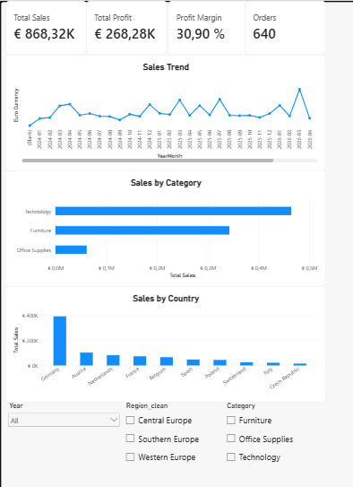
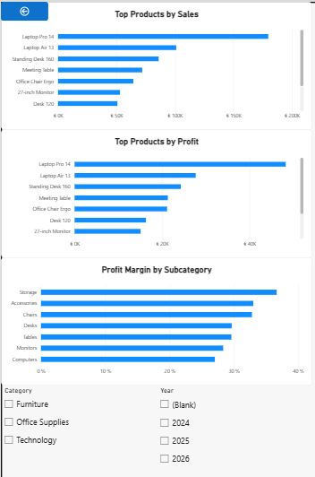
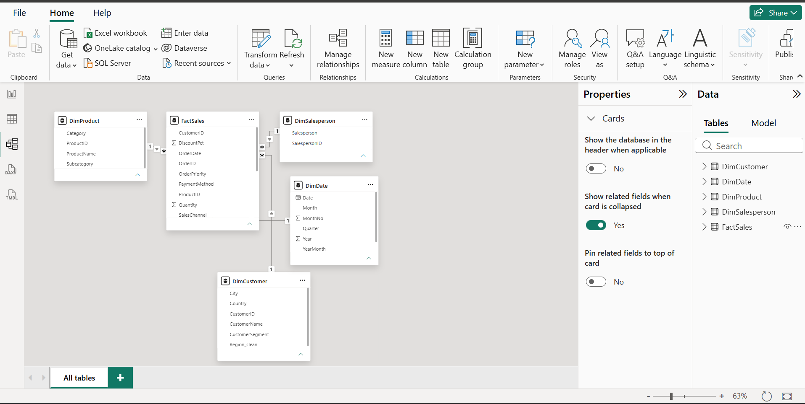

# Power-Bi-Sales-analytics-dashboard
Interactive Power BI Sales Analytics Dashboard using Power Query, DAX and star schema
# Sales Analytics Dashboard – Power BI

## Project Overview

This project is an interactive Sales Analytics Dashboard built in Power BI.

The goal of the project was to transform raw sales data into a structured analytical model and create dashboards that provide insights into sales performance, profitability, product performance, customer behaviour, and regional trends.

The project covers the complete analytics workflow from data cleaning and transformation to data modelling, DAX calculations and dashboard development.

## Tools Used

- Power BI
- Power Query
- DAX
- Excel
- Data Modelling
- Star Schema

## Dataset

The dataset contains more than 1,000 sales records across several European countries.

Key fields include:

- Order ID
- Order Date
- Customer
- Country
- Region
- Product
- Category
- Quantity
- Unit Price
- Unit Cost
- Discount
- Sales Channel
- Salesperson

The raw data also contained several data-quality issues that were cleaned during the project.

## Data Cleaning

Data preparation was performed using Power Query.

Main cleaning steps included:

- Standardising date formats
- Standardising country names
- Correcting inconsistent category values
- Handling missing region values
- Removing duplicate orders
- Checking and correcting data types
- Preparing dimension tables for the data model

## Data Model

A star schema was created with the following tables:

### Fact Table
- FactSales

### Dimension Tables
- DimCustomer
- DimProduct
- DimSalesperson
- DimDate

The dimension tables are connected to FactSales using one-to-many relationships.

## DAX Measures

Several DAX measures were created, including:

- Total Sales
- Total Cost
- Total Profit
- Profit Margin
- Orders
- Units Sold
- Average Order Value

Example:

DAX

Total Profit =
[Total Sales] - [Total Cost]

## Dashboard Pages
1. Executive Overview
The Executive Overview provides a high level view of sales performance.
It includes:
•	Total Sales
•	Total Profit
•	Profit Margin
•	Number of Orders
•	Monthly Sales Trend
•	Sales by Category
•	Sales by Country
•	Year, Region and Category filters
2. Product Analysis
The Product Analysis page focuses on product level performance.
It includes:
•	Top 10 Products by Sales
•	Top 10 Products by Profit
•	Profit Margin by Subcategory
•	Category filter
•	Year filter

### Business Questions
The dashboard was designed to answer questions such as:
•	How are sales developing over time?
•	Which products generate the highest revenue?
•	Which products generate the highest profit?
•	Which product categories have the strongest profit margins?
•	Which countries generate the most sales?
•	How does performance differ across regions?
•	Which products have high sales but comparatively low profitability?

## Screenshots

### Executive Overview

### Product Analysis

### Data Model

## Key Skills Demonstrated
•	Data cleaning with Power Query
•	Data modelling using a star schema
•	Relationship management
•	DAX measure development
•	KPI development
•	Time-series analysis
•	Product performance analysis
•	Data visualisation
•	Interactive dashboard design
•	Business-focused data analysis
## Project Status
Completed Power BI portfolio project.
Future improvements may include:
•	Year-over-Year growth measures
•	More advanced time-intelligence calculations
•	Customer segmentation analysis
•	Additional drill-through functionality

## Key Insights

- The dashboard shows total sales of approximately **€868.32K**, generating **€268.28K in profit** with an overall **profit margin of 30.90%**.
- **Technology** is the strongest-performing product category by sales, followed by **Furniture**, while **Office Supplies** contributes a much smaller share of total revenue.
- **Germany** is clearly the strongest market by sales and contributes significantly more revenue than the other analysed countries.
- **Laptop Pro 14** is the strongest individual product, ranking first in both **total sales and total profit**.
- **Laptop Air 13** and **Standing Desk 160** are also among the strongest products in terms of both revenue and profitability.
- At subcategory level, **Storage** has the highest profit margin, at roughly **37%**, followed by Accessories and Chairs.
- The monthly sales trend shows noticeable fluctuations, with several strong sales peaks and the highest visible peak occurring during **2026**.
- The comparison between sales and profit demonstrates that the highest-revenue products are generally also among the strongest profit contributors, although profitability differs across product groups.

